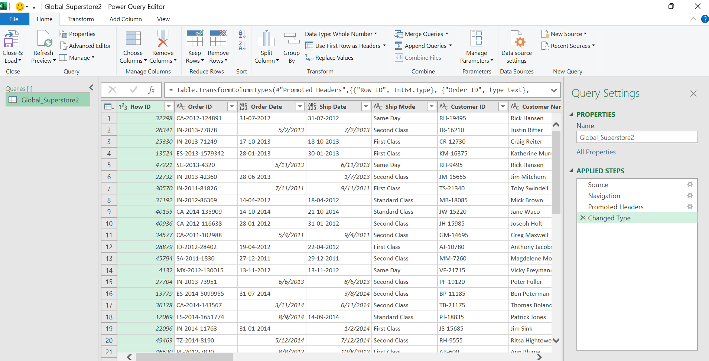
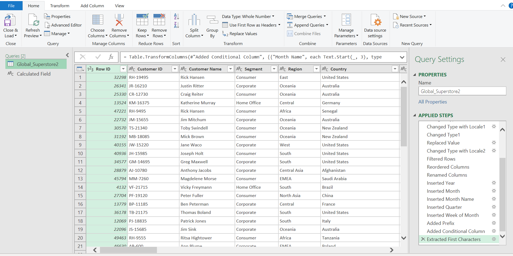
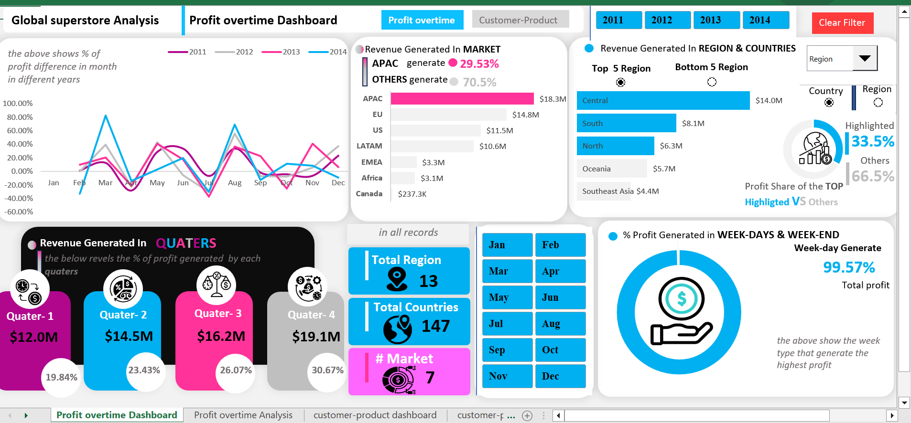
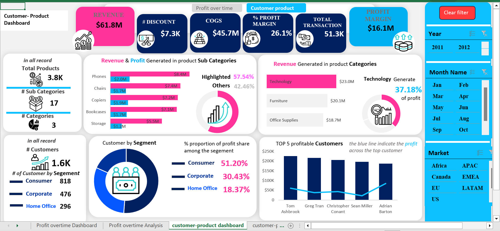

# Global superstore analysis

  
## Project Overview
---

This Global superstore Project Analysis aims to provide insight of global superstore sales by analyzing various top sales in **Region**, **Countries** and **Market**, Providing the Profit and Revenue generated over time across the Top sales, it also aim to identify Product that is mostly demanded in Market and to get a deeper understanding of sales pattern Customers by segment

### Data Source

Global superstore dataset : The dataset used for this analysis and project is the "Global superstore.csv" file. this contain financial information of sales made in different Countries, Region and Market

### Problem Statement
1. Which Market generate the highest Revenue & Profit?
2. What Top/Bottom Countries and Regions generates the Highest and Lowest Sales?
3. What is the gross Profit generated over time across Years, Quaters and weeks?
4. What is the most demanded Products by Categories and Sub-Categories in Market and the Revenue & Profit generated in those demand?
5. What is the Proportion of sales pattern of Customer by segment?
6. What is the top Profitable Customers and the Revenue generated?

### Tool / Skills Demonstrated

#### Tool

Excel

#### Skills Demonstrated

The following Features of Excel was incorpurated
- Power Query
- Power Pivot
- Filters
- DAX
- Quick Measure
- Page Navigation
- Clear Filter using Macro
- Visualization
- Option box / Combo box

### Data Cleaning (Power Query)

Tasks used to clean the data in preparation for the Analysis and Visualization
- Changed text type
- Proper Organization, Re-arrangement and change text type of Date column using locale
- Replaced Blank cells in Postal code column with null
- Extracted characters for analysis

Before Data Cleaning                                |                         After Data Cleaning
:--------------------------------------------------:|:--------------------------------------------:
 |  

### Data Analysis and Findings

#### Profit OverTime Analysis and Findings

- **APAC** Market generate the highest Revenue with over 0.5% increase across the years
- The Top 3 OUT OF Top 5 countries generate 45.1% Revenue, showing **United State** generating the highest sales
- There is significant increase in gross Profit & Revenue overtime
- The **4th Quater** generate the highest revenue of $3.9M and is seen with a significate increase across the Years
- Weekdays generate the highest revenue and profit with over 99%

#### Customer-Product Analysis and Findings

- In product Categories, **Technology**, generate the highest sales and a profit magin of 37.18% amoung the three Categories, and remained the top selling Product category in Market except _CANADA_ and _LATAM_ Market
- The Top 5 most sold and profitable Product by Sub-Categories generate over 55% Revenue from the 17 product Sub-Ctegories over the months, years and Market
- In the Analysis, **Consumers** made the highest orders by Customer Segment Generated over 49% of Revenue amoung the three segments
- It is seen that **$61.8M Revenue** was generated, A Total **Discount of $7.3K**, A generated **$16.1M Profit** and a **Total Transaction of 51.3K**

### Visualization 

The Result comprises of
- Profit Overtime Dashboard
- Customer-Product Dashboard

Profit Overtime Dashboard                      |                     Customer-Product Dashboard                
:---------------------------------------------:|:-----------------------------------------------:
 |  

**_To interact with the result_**
- [click here](Analysis_of_globalsuperstore_data.xlsm)

**_Please note_** : This is a **MACRO ENABLES WORKBOOK** to be able to interact with the macro worksheet without interferance of blocked macro
1. check the **_Unblock_** in security in properties setting
2. enable macro in the macro settings when you open the file.
 
_if error of macro presist_ close and reopen the workbook and run the macro on the clicked **_clear filter_** button

## Recommendation

- invest in marketing and promotion of Product in Canada Market to increase revenue generated
- Bundling Product strategies can be implemented for the least selling Product
- Refocus advertizing strategy to the least revenue generated contries

## Limitation
I had to remove the negative in values located in profit column because it wlii affect the accuracy of the calculated columns when using DAX in Quick measure
