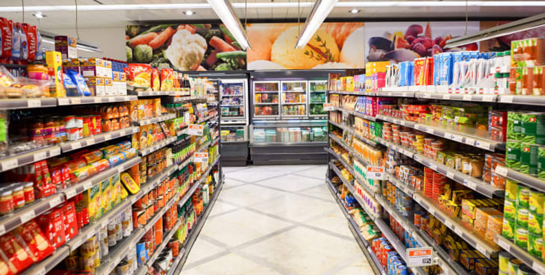

# Global superstore analysis

## Project Over view
---

This Global superstore Project Analysis aims to provide insight of global superstore sales by analysizing various top sales in **Region**, **Countries** and **Market**, Providing the Profit and Revenue generated over time accross the Top sales, it also aim to identify Product that is mostly demanded in Market and to get a deeper understanding of sales pattern Customers by segment

### Data Source

Global superstore dataset : The dataset used for this analysis and project is the "Global superstore.csv" file. this contain financial information of sales made in different Countries, Region and Market

### Problem Statement
1. Which Market generate the highest Revenue & Profit
2. What Top/Bottom Countries and Regions generates the Highest and Lowest Sales
3. What is the gross Profit generated over time accross Years, Quaters and weeks
4. What is the most demanded Products by Categories and Sub-Categories in Market and the Revenue & Profit generated in those demand
5. What is the Proportion of sales pattern of Customer by segment

